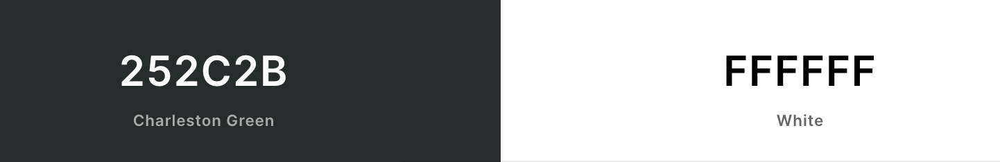

# Rock Paper Scissors

This is the classic game of Rock Paper Scissors where you can play against the computer to see who can get the highest score.

You can view the live site here. [Rock Paper Scissors](https://jakeshaw61.github.io/rock-paper-scissors/)

## User Experience

### User Stories

### As a site creator:
- I want to make the site visually appealing upon first impression, so the user is interested in returning to the site.
- I want to make the site easy to navigate for the user.
- I want the user to be able to easily understand how to play the game.

### As a first time user:
- I want to be able to have fun palying the game.
- I want to be able to easily understand how to play.
- I want to be able to keep trying to improve my score.

### As a returning user:
- I want to feel that i am familiar with the site.  
- I want to be able to remember how to play. 

## Design 
I wanted a minimalist overall design with large icons and a simple colour scheme so the focus remains on the game and doesnt confuse the user.

### Colour Scheme

I chose a dark grey background for the site with white text and icons. This white text stands out and creates a good contrast against the background. 

### Typography
I have used 1 font throughout the site which is called Play, it is from Google fonts. I chose this font at is easy to read and also has a gaming impression. I choose Sans Serif as a fallback font. 

### Icons 
- I chose 3 icons from FontAwesome which represent rock, paper and scissors. I used these icons as visual aid for the user when making their choice.

## Wireframes 
I used Balsamiq to make some wireframes of how I wanted the site to look. Making the wireframes was very useful as I was able to imagine what the pages and features would look like on different size screens. 

[Wireframes](https://github.com/jakeshaw61/rock-paper-scissors/tree/main/assets/wireframes)

## Features

### Title

The page features a large title containing the name of the site and the name of the game.

### Rules

This is where the rules of the game are explained to the user.

### Result
 

This is where the result of the round will be shown. It will say what the option the computer has chosen and who won the round.

### Scoreboard
 

This is where score will be displayed for the user and the computer.

### Rock Paper Scissors options  
 
This is where the 3 option buttons for the game are shown, where the user will confirm their choice.

### Future Features
- Highest score feature where users can add their name to the board.
- More buttons, with the choices Lizard and Spock
- Restart button

## Testing 
I have tested the site on Chrome, Safari and Firefox and all the feautues work as intened. I have also tested on mobile sizes and tablet. I designed the site using a mobile first approach so all the features work the same on small size devices as they do larger sizes. 

### Html 
I used the [W3C Markup Service](https://validator.w3.org/) to validate my HTML. No errors were found.
 
### CSS
I used the [W3C CSS Validation Service](https://jigsaw.w3.org/css-validator/) to validate my CSS. No errors were found. 

### JavaScript
I used the [Jshint Validator](https://jshint.com/) to validate my JaveScript. No errors were found. The following metrics were returned:
- There are 5 functions in this file.
- Function with the largest signature take 1 arguments, while the median is 0.
- Largest function has 21 statements in it, while the median is 6.
- The most complex function has a cyclomatic complexity value of 14 while the median is 1.

### Lighthouse 
I used Chromes Dev Tools lighthouse feasture to run the site throught to test for Performance, Accessability, Best Practices and SEO.

### Responsive 
I used a mobile first approach when designing the site, starting off at the smallest screen size of 320px and scaling it up to screen sizes larger than 1200px. I used Flex-Box throughout the site, so when i came to the media queries i only had to make some simple changes like flex-direction or justify-content to make it responsive for other screen sizes. 

## Deployment 
The site was deployed to GitHub pages, the steps to deploy are as follows:
- In the GitHub repository, navigate to the Settings tab.
- Scroll down to the GitHub Pages setion and from the source section drop-down menu, select the Master Branch and click save.
- Once the master branch has been selected, the page will be automatically refreshed with a detailed ribbon display to indicate the successful deployment.

## Credits 

### Content 
- Icons taken from [Font Awesome.](https://fontawesome.com/)
- Deployment instructions take from Code Institute readme template. 
- Colour palette was taken from [Coolors.](https://coolors.co/)

### Media 
- Icons taken from [Font Awesome.](https://fontawesome.com/)

### Acknowledgements 
- To the Slack community i managed to solve a couple of issues.
- Stack Overflow as valuable source of information.
- [W3Schools](https://www.w3schools.com/) 
- Youtube tutorial from FreeCodeCamp. [Youtube tutorial](https://www.youtube.com/watch?v=jaVNP3nIAv0&ab_channel=freeCodeCamp.org)
- Youtube tutorial from Code with Ania Kubow. [Youtube tutorial](https://www.youtube.com/watch?v=RwFeg0cEZvQ&ab_channel=CodewithAniaKub%C3%B3w)
